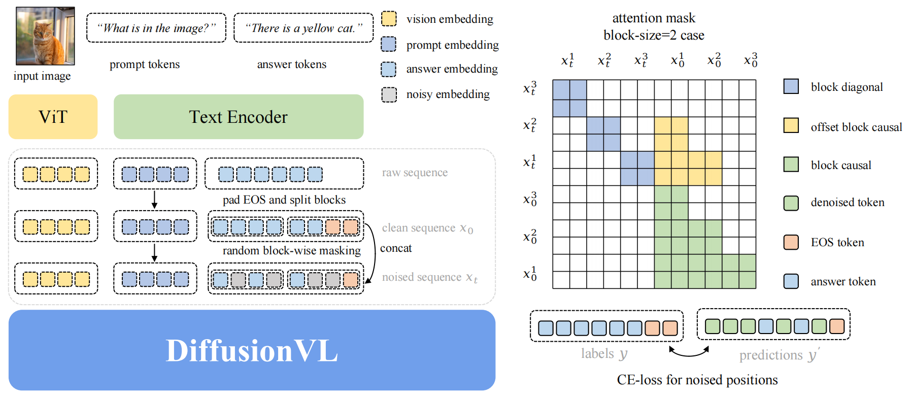

<div align="center">

<h1>DiffusionVL: Translating Any Autoregressive Models into <br> Diffusion Vision Language Models</h1>

**_SOTA dVLM Performance with <5% Data & 2.0× Inference Speedup!_**

[Lunbin Zeng](https://github.com/xiazhi1)<sup>1,\*</sup>, [Jingfeng Yao](https://github.com/JingfengYao)<sup>1,\*</sup>, [Bencheng Liao](https://github.com/LegendBC)<sup>1</sup>, [Hongyuan Tao](https://github.com/Hongyuan-Tao)<sup>1</sup>, [Wenyu Liu](https://scholar.google.com/citations?user=D7jDk7gAAAAJ&hl=en)<sup>1</sup>, [Xinggang Wang](https://xwcv.github.io)<sup>1, :email:</sup>

<sup>1</sup>Huazhong University of Science and Technology

<sup>*</sup>equal contribution, <sup>:email:</sup>corresponding author, xgwang@hust.edu.cn

[](https://arxiv.org/abs/2503.xxxxx) <a href="https://huggingface.co/collections/hustvl/diffusionvl"></a>

</div>

## 📰 News

- **[2025.12.18]** 🎉 Our paper **DiffusionVL** is released on arXiv! And we release the DiffusionVL models translated from Qwen2.5VL at huggingface. The training code and more models are comming soon!

## 📄 Introduction

The diffusion paradigm has emerged as a promising alternative to autoregressive (AR) models, offering the potential for efficient parallel decoding. However, existing diffusion vision language models (dVLMs) largely lag behind mainstream autoregressive vision language models in performance, primarily due to the capability limitations of their base diffusion language models.

DiffusionVL bridges this gap by answering a fundamental question: ***Can we directly translate any existing autoregressive models into powerful diffusion vision language models?*** We propose a diffusion finetuning framework that "translates" any pretrained AR model into a diffusion vision language model through a simple paradigm shift and modality shift. Unlike prior dVLMs restricted by fixed generation lengths, DiffusionVL introduces a novel block decoding strategy. This allows for arbitrary-length generation and KV-cache reuse. With this integrated design, despite training with less than 5% of the training data required by previous methods, DiffusionVL translated from AR-VLMs achieves a state-of-the-art performance among exsiting dVLMs and delivers a 2.0× inference speedup.

## ✨ Highlights

- **Universal Translation Framework:** Translate any AR models into dVLMs with a simple yet effective approach.

- **Superior Performance:** Achieve SOTA dVLM performance using <5% training data (738K vs 16.5M samples).

- **2.0× Faster Inference:** Block decoding strategy enables KV-cache reuse and 2.0× speedup over previous dVLMs.

<div align="center">


</div>


### 🎯 Inference with Pre-trained Models

- **Download Pre-trained Models:**

| Model | Base Model | Download |
| :--- | :---  | :--- |
| **DiffusionVL-Qwen2.5VL-3B** | Qwen2.5-VL-3B | [HuggingFace](https://huggingface.co/hustvl/DiffusionVL-Qwen2.5VL-3B) |
| **DiffusionVL-Qwen2.5VL-7B** | Qwen2.5-VL-7B | [HuggingFace](https://huggingface.co/hustvl/DiffusionVL-Qwen2.5VL-7B) |

- **Environment Setup:**
  
The core environments are list as follows:
```
torch==2.6.0
torchvision==0.21.0
torchaudio==2.6.0
transformers==4.55.0
accelerate==1.10.1
pillow==10.4.0
requests=2.32.5
```

- **Quick Start:**

```python
from transformers import AutoModelForCausalLM, AutoProcessor
import torch

# Load model with trust_remote_code
model = AutoModelForCausalLM.from_pretrained(
    "hustvl/DiffusionVL-Qwen2.5VL-7B",
    torch_dtype=torch.bfloat16,
    device_map="auto",
    trust_remote_code=True
)

# Load processor (includes tokenizer)
processor = AutoProcessor.from_pretrained("hustvl/DiffusionVL-Qwen2.5VL-7B", trust_remote_code=True)

from PIL import Image
import requests

url = "https://qianwen-res.oss-cn-beijing.aliyuncs.com/Qwen-VL/assets/demo.jpeg"
image = Image.open(requests.get(url, stream=True).raw).convert("RGB")
messages = [
    {"role": "user", "content": [
        {"type": "image"},
        {"type": "text", "text": "Describe this image."}
    ]}
]
text = processor.tokenizer.apply_chat_template(messages, tokenize=False, add_generation_prompt=True)
inputs = processor(text=[text], images=[image], return_tensors="pt", padding=True)
inputs = {k: v.to(model.device) if hasattr(v, 'to') else v for k, v in inputs.items()}

# Generate with diffusion
output_ids = model.generate(
    inputs=inputs["input_ids"],
    images=inputs.get("pixel_values"),
    image_grid_thws=inputs.get("image_grid_thw"),
    gen_length=128,
    steps=8,
    temperature=0.0,
    remasking_strategy="low_confidence_static",
)

# Decode output
output_text = processor.decode(output_ids[0], skip_special_tokens=True)
print(output_text)

```

## ❤️ Acknowledgements

This repo is mainly built on [Qwen2.5-VL](https://github.com/QwenLM/Qwen3-VL), [LLaDA-V](https://github.com/ML-GSAI/LLaDA-V), [BD3LMs](https://github.com/kuleshov-group/bd3lms) and [SDAR](https://github.com/JetAstra/SDAR). We thank the authors for their open-source contributions.

## 📝 Citation
If you find our work useful, please cite our paper:
```
@article{zeng2025diffusionvl,
  title={DiffusionVL: Translating Any Autoregressive Models into Diffusion Vision Language Models},
  author={Zeng, Lunbin and Yao, Jingfeng and Liao, Bencheng and Tao, Hongyuan and Liu, Wenyu and Wang, Xinggang},
  journal={arXiv preprint arXiv:2503.xxxxx},
  year={2025}
}
```